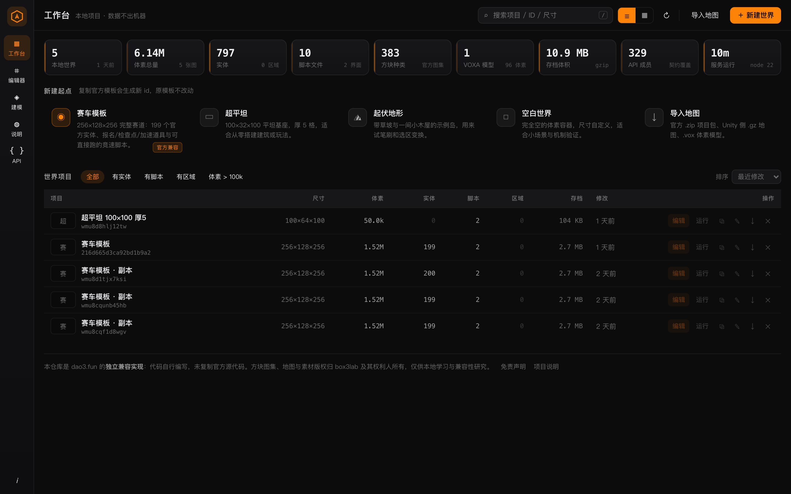
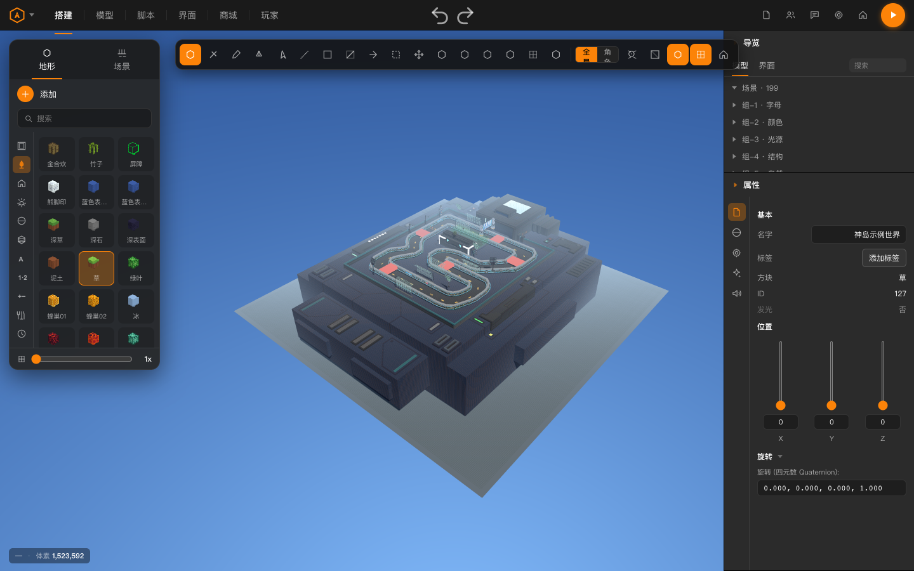
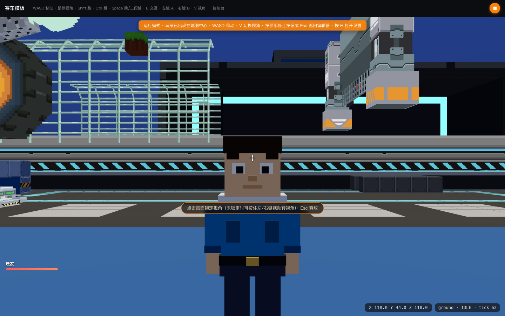
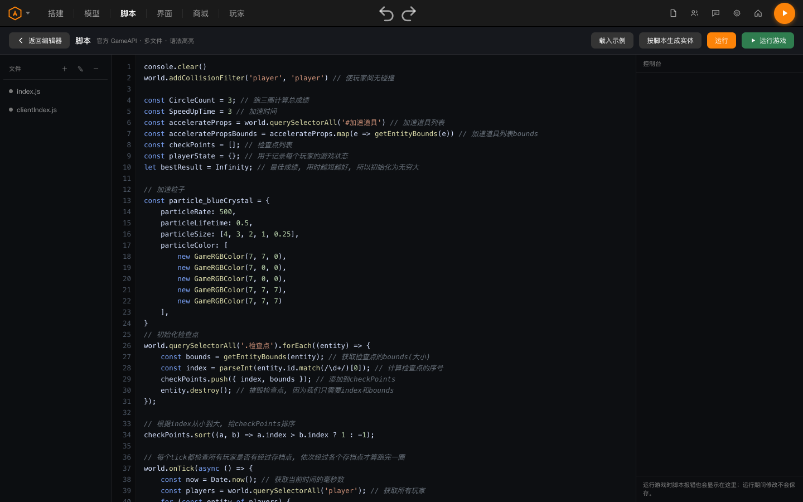
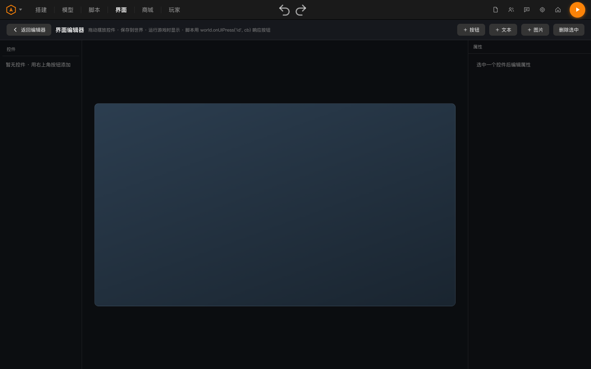
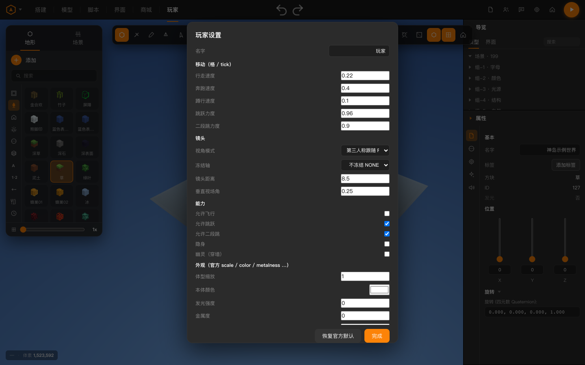
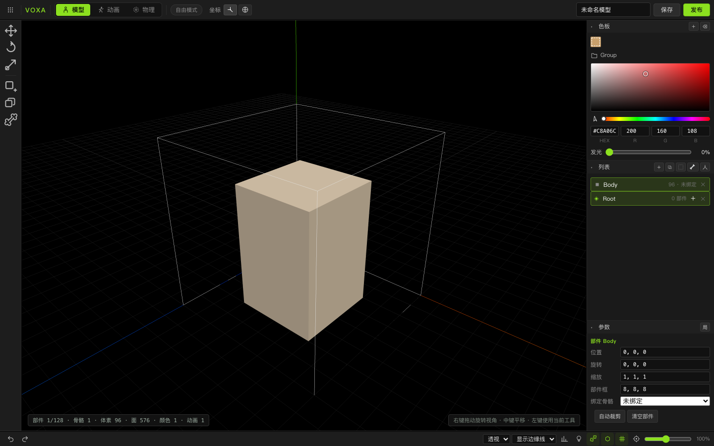

# DAO3 编辑器复刻

dao3.fun（神奇代码岛 / DAO3 Arena）编辑器与运行时的**本地独立兼容实现**。

不是演示稿，不是重构练习：官方导出的地图能打开，官方写法的脚本能跑，
`world.querySelector("#报名点")`、`player.walkSpeed`、`voxels.setVoxel(x,y,z,"stone",3)`
这些调用按官方类型声明的语义工作。全部代码在本仓库自行编写，
依据的是官方**公开**的文档与类型声明，未复制、未反编译任何官方源代码。

| | |
|---|---|
| 在线文档 / 介绍站 | <https://deepseekv5.github.io/dao3/> |
| 运行时要求 | Node.js ≥ 18，**零第三方依赖**（只用 Node 内置模块） |
| 授权 | Apache-2.0（代码）· 素材来源见 [THIRD_PARTY_NOTICES.md](THIRD_PARTY_NOTICES.md) |
| 与官方关系 | 无任何隶属、授权或背书关系 |

---

## 三分钟跑起来

不需要 `npm install`——没有任何依赖要装。

**macOS / Linux**
```bash
./run.sh                    # 或双击 启动-macOS.command
```

**Windows**
双击 `启动-Windows.bat`，或在 PowerShell 里：
```powershell
powershell -ExecutionPolicy Bypass -File run-win.ps1
```

启动后自动打开 <http://127.0.0.1:5173/>，端口被占用会自动顺延并打印实际地址。
地图存在 `server/data/worlds/` 下（gzip JSON，与官方 Unity 侧 `.gz` 导出同格式），
纯本地读写，不联网。

<details>
<summary>用 Node 直接跑（三端同一入口）</summary>

```bash
node start.mjs --port=5173 --no-open
```
</details>

---

## 截图



| | |
|---|---|
|  |  |
| 搭建：383 种方块、选区镜像/旋转、模型摆放 | 运行：20 TPS 定步长物理、第三人称、HUD 与聊天 |
|  |  |
| 多文件脚本，服务端 GameAPI / 客户端 ClientAPI | 拖放控件，运行时由 `world.onUIPress` 响应 |
|  |  |
| 官方 41 个 player 字段：14 音效槽、18 皮肤槽、虚拟按键 | 部件 + 骨骼 + 24fps 动画，导出 glb 直接进图 |

---

## 它到底"兼容"到什么程度

不是"看着像"，是有断言可查的。`test/runtime_parity.mjs` 用真实浏览器驱动运行时，
**112 条断言全绿**（默认执行 107 条，另 5 条需 `RACING_ZIP` 夹具），覆盖：

- **单位制**：官方 `walkSpeed 0.22 格/tick`、`64ms/tick`、`gravity -0.1`、
  `jumpPower 0.96`——在现搭的确定性平台上量出来的位移/跳跃高度必须落在官方量级
- **碰撞语义**：`transparent` 只是渲染标记（玻璃挡人），只有 `fluid`（含 `air`）不挡；
  实体碰撞盒按盒心积分；单帧 5 格位移不得隧穿；1 格墙走路爬不上去、起跳才能过
- **方块旋转码**：`turn t` 时世界面贴的是方块第 `(d−t) mod 4` 个方向的面，
  与官方"正面朝北、每顺时针 90° 加 16384"逐条对齐
- **粒子**：`color0..4` / `size0..4` 是存活期五等分的阶段取值，颜色为 ×1000 定点数
- **相机**：`cameraFreezedAxis` 八种取值逐个生效；`FOLLOW` 身体转向移动方向、
  `RELATIVE` 身体刚性对齐镜头
- **玩家**：`scale` 同时放大人偶与物理盒；`spectator`＝官方"幽灵可穿墙"；
  `color/metalness/emissive/shininess` 赋值即时改到材质上
- **沙箱**：服务端脚本看不到 `ui/input/Ui*`，客户端脚本看不到 `voxels/storage/Game*`
- **项目包**：导出的 `player.json` 是官方 41 键形状，本地扩展走 `compat.json`，
  导出→导入回环不丢字段

另外 `scripts/api-audit.mjs` 从官方 `GameAPI.d.ts` / `ClientAPI.d.ts` 抽出
**329 个可调用成员**，`public/js/api-probe.js` 在真实运行时上逐个探面对账。

```bash
npm test          # 77 条断言（需先起服务）
npm run test:e2e  # 35 条端到端断言（免责声明门禁、建图、运行模式、每页返回主界面）
npm run audit:api # 官方 API 面覆盖率
```

---

## 官方赛车模板

模板本身**不随仓库分发**（地图数据与音频属于在线游戏内容，无再分发授权）。
仓库带的是那份 824 字节的 CID 清单，用你自有的访问权限取回：

```bash
npm run fetch:official
```

脚本按 `official-project/cids.json` 逐个下载，并用 sha256 → base58btc 重算 CID
校验内容一致（该实现已用官方 40 个音频 40/40 验证）。取回后本地种子世界会被
替换为真实的 199 实体 / 256×128×256 赛道：报名点、检查点、加速道具、
可直接跑的竞速脚本。缺赛道模型时实体以占位盒显示，玩法逻辑不受影响。

---

## 目录结构

```
server.js      零依赖本地服务：静态资源 + 世界持久化 REST + 世界资产上传
start.mjs      跨平台启动器（端口探测 / 局域网地址 / 图集检查 / 打开浏览器）
public/js/
  main.js      编辑器装配：加载世界、指针→拾取→工具、UI、进/出运行模式
  world.js     稀疏体素容器（Map + pack index），与官方 .gz payload 互转
  renderer.js  Three.js 体素网格：分块、面剔除、动画瓦片、天气、区域预览
  game.js      官方 GameAPI 运行时：tick 时钟、角色控制器、相机、方块玩法、
               区域触发、实体/玩家 API、脚本沙箱、运行 HUD
  gapi.js      官方值类型 / 枚举 / 事件通道 / 默认值（逐字段对照 d.ts）
  clientui.js  官方 ClientAPI：UiNode 树、input、screen、Audio
  io.js        官方项目包 .zip 导出/导入、.gz、.vox、CID 计算
  features.js  地图尺寸、多文件脚本、实体生成、模型库、商城、玩家面板
  home.js      工作台：指标、项目表、复制/改名/导出/删除、导入
scripts/       图集构建、API 审计、官方数据取回、便携包打包、截图
test/          真实浏览器回归套件
docs/          介绍站与开发文档（GitHub Pages 源）
```

---

## 开发文档

全部在 [docs/](docs/) 下，同时也是[介绍站](https://deepseekv5.github.io/dao3/)的内容：

- [架构与数据流](docs/architecture.md) — 编辑器/运行时如何共享一份世界状态
- [官方 API 兼容层](docs/api-compat.md) — 329 个成员怎么对账，哪些语义容易踩错
- [数据格式](docs/data-format.md) — `.gz` payload、`project.json` 21 键、`compat.json` 的边界
- [物理与单位制](docs/physics.md) — 为什么是"格/tick"，碰撞判据的官方依据
- [测试与验证](docs/testing.md) — 怎么在后台标签页里确定性地推进 tick
- [便携包与发布](docs/packaging.md) — 打包、三端启动、素材授权切分
- [依赖清单](docs/dependencies.md) — 真的在跑的第三方代码只有 three.js r160；其余是 Node 内置
- [致谢](docs/credits.md) — 公开类型声明为什么是兼容层的前提，以及与官方的授权边界
- [Windows 支持说明](docs/windows.md) — 已审计项与未在 Windows 实机的边界

上面这些 `.md` 在 GitHub 上直接可读；介绍站（`deepseekv5.github.io/dao3`）用的是同一批内容，
由 `scripts/build-docs.mjs` 编译成 `docs/*.html`（与站点共用 `docs/site.css`）。
**改文档请改 `.md`，不要改生成的 `.html`。**

```bash
npm run build:atlas   # 重建方块图集（需先 clone 上游纹理，见文档）
npm run build:docs    # docs/*.md -> docs/*.html（介绍站与开发文档）
npm run package       # 生成便携包
```

跑起来后本地也能看：`./run.sh` 之后访问 <http://127.0.0.1:5321/docs/>。

---

## 授权与免责声明

代码按 [Apache-2.0](LICENSE) 发布；[NOTICE](NOTICE) 与
[THIRD_PARTY_NOTICES.md](THIRD_PARTY_NOTICES.md) 说明每类素材的来源与授权，
再分发时必须一并保留。

方块贴图、方块 ID 表、地图数据、模型与音频素材的**著作权归 box3lab 及其权利人所有**。
本仓库不含游戏素材本体；用你自有权限取回的内容仅限本地学习与兼容性研究，
不得用于商业分发、公开镜像或冒充官方产品。

本项目与 box3lab / 神奇代码岛官方无任何隶属、授权或背书关系。
